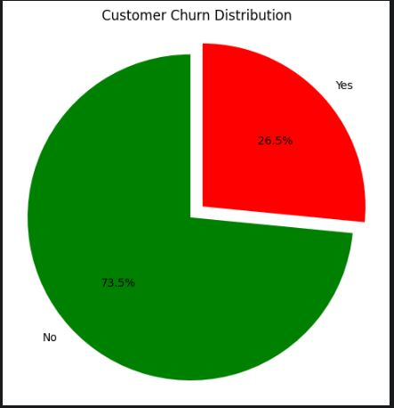
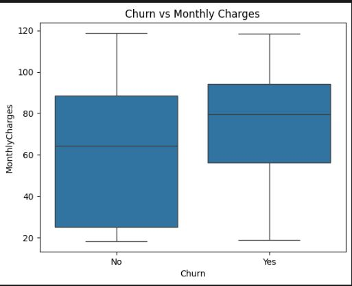
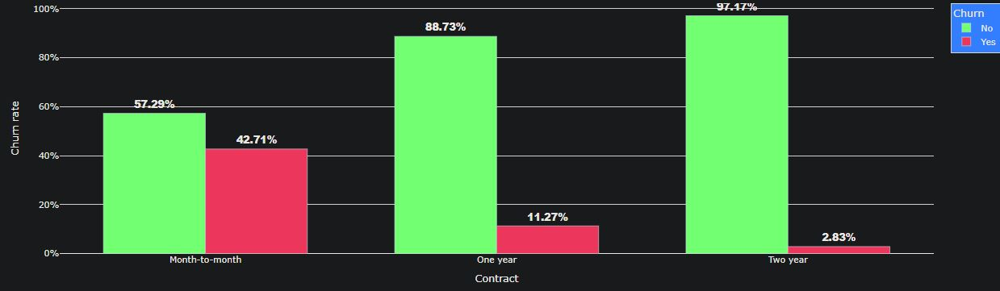
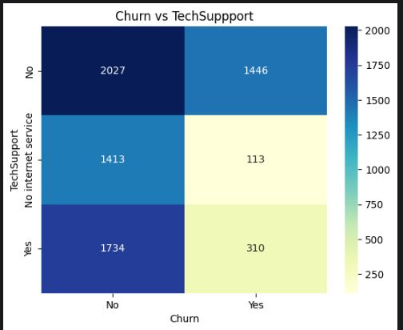

## 📊 Business Analysis with Python – Data Analysis Project
🧠 Project Objective
This project aims to uncover valuable business insights from customer data using Python's data analysis libraries. The primary goal is to identify patterns, trends, and actionable insights that can support better decision-making and improve overall business performance.

## 📂 Dataset Description
Dataset Name: Telco.csv

Source: Telecom company’s customer dataset

Records: ~7,000 customers

Features:

Customer ID, Gender, Senior Citizen, Partner, Dependents

Tenure, Phone & Internet Services

Contract, Payment Method, Monthly Charges

Total Charges, Churn Status, etc.

## 🔧 Tools & Technologies Used
Language: Python

IDE: Jupyter Notebook

Libraries:

pandas – Data manipulation

numpy – Numerical calculations

matplotlib & seaborn – Data visualization

scipy – Statistical testing

plotly – Interactive visualizations (optional)

## 📈 Key Steps & Workflow
📥 Data Loading
Imported dataset using pandas

Initial inspection using .head(), .info(), and .describe()

## 🧹 Data Cleaning
Checked for null values and data types

Handled missing or incorrect values in TotalCharges

Converted columns to appropriate data types

## 🔍 Exploratory Data Analysis (EDA)
Univariate analysis: distribution of numerical & categorical features

Bivariate analysis: churn vs tenure, charges, contract type, etc.

Correlation heatmaps to identify strong relationships

Visualized key patterns influencing customer churn

### 4️⃣ Customer Segmentation
- Created **tenure groups** (0–12 months, 13–24, etc.).
- Segmented by service usage and payment preferences.
- Visualized churn by each segment using pie and bar charts.

## 🧠 Business Insights
Customers on month-to-month contracts had higher churn rates

High churn among customers with fiber optic internet

Senior citizens and single customers are more likely to churn

Electronic checks associated with higher churn

## 📌 Actionable Recommendations
Offer discounts on long-term contracts to reduce churn

Improve customer support for high-risk groups (e.g. senior citizens)

Incentivize online auto-pay methods to reduce churn

## 📊 Highlighted Visuals

Churn distribution pie chart

 ← 

Boxplots: Monthly Charges vs Churn

 ← 

Bar charts: Contract Type vs Churn Rate

 ← 

Heatmap of feature correlations

 ← 

### 5️⃣ Predictive Modeling
Tested and compared multiple classification models:

| Model                  | Accuracy |
|------------------------|----------|
| Logistic Regression    | **0.7991** |
| Decision Tree          | 0.7374 |
| Random Forest          | 0.7842 |
| Gradient Boosting      | **0.7991** |

**Best Models:** Logistic Regression & Gradient Boosting (both at 79.91% accuracy).  
Logistic Regression was chosen for interpretability, while Gradient Boosting provided competitive predictive performance.

---

classification models comparison

 ← 

## 📈 Key Insights
- **Short-tenure customers** have the highest churn rate.
- **Month-to-month contracts** and **electronic check payments** are strong churn indicators.
- Customers without **tech support** or **online security** are more likely to churn.
- Higher **monthly charges** correlate with higher churn risk.

---

## 💡 Business Recommendations
1. **Promote long-term contracts** to new customers.
2. Offer **bundled services** (internet + TV + tech support) at a discount.
3. Target **high-risk customers** with loyalty incentives.
4. Improve **customer support touchpoints** for month-to-month customers.

---

## 🖥 Tech Stack
- **Python**: `pandas`, `numpy`, `matplotlib`, `seaborn`, `scikit-learn`
- **Jupyter Notebook**
- **Data Visualization**: Matplotlib & Seaborn
- **Machine Learning Models**: Logistic Regression, Decision Tree, Random Forest, Gradient Boosting

---
